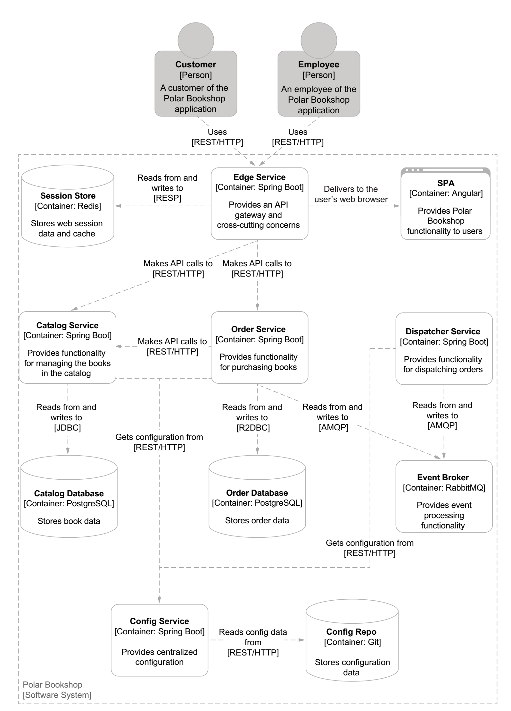

# Polar Bookshop: A cloud native application
Polar Bookshop is a specialized bookshop whose mission is to spread knowledge and
information about the North Pole and the Arctic, where the bookshop is located: the Arctic’s history, geography, animals, and so on. The organization managing the
bookshop, Polarsophia, has decided to start selling its books online to spread them
worldwide, but that is only the beginning. The project is very ambitious, and the vision
includes a suite of software products to fulfill the Polarsophia mission. After the successful pilot project earlier in this chapter, the organization has decided to embark on
a cloud native journey.

The management plans to deliver new
features in short iterations, reducing the time to market and getting early feedback
from users. Their goal is to bring the bookshop close to everyone, everywhere, so the
application should be highly scalable. With a worldwide audience, such a system needs
to be highly available, so resilience is essential.
Polarsophia is a small organization, and they need to optimize costs, especially
those regarding infrastructure. They can’t afford to build their own data center, so
they have decided to rent IT hardware from a third party.

Books will be available for sale through the application. When a customer purchases a book, they should be able to check on the status of their order. Two categories of people will use the Polar Bookshop application:
* Customers can browse books in the catalog, buy some, and check their orders.
* Employees can manage books, update existing ones, and add new items to the
catalog.

Next figure describes the architecture of the Polar Bookshop cloud native system. As
you can see, it’s made up of several services. Some will implement the business logic of
the system to provide the functionality already mentioned. Other services will implement shared concerns like centralized configuration. For clarity, the figure doesn’t
show the services responsible for the security and observability concerns. 


## patterns and technologies used in the project
Here I’ll give you an overview of
the main concerns we will address and the technologies and patterns we’ll use to
accomplish them.

### WEB AND INTERACTIONS
Polar Bookshop comprises several services that will have to communicate with each
other to provide their functionality. You’ll build RESTful services that interact synchronously over HTTP, both in a blocking way (using traditional servlets) and nonblocking ways (using reactive programming). Spring MVC and Spring WebFlux (on
top of Project Reactor) will be your main tools for accomplishing such a result.
When building cloud native applications, you should design loosely coupled services and consider how you can keep data consistent in a distributed system context.
Synchronous communications can generate problems when multiple services are
involved in accomplishing a function. That’s why event-driven programming is getting very popular in the cloud: it allows you to overcome the issues of synchronous
communications.
I’ll show you how to use events and messaging systems to decouple services and
ensure data consistency. You’ll use Spring Cloud Stream to implement data streams
between services and Spring Cloud Function to define message handlers as functions.
The latter approach could naturally evolve in serverless applications deployed to platforms like Azure Functions, AWS Lambda, or Knative. 
### DATA
Data is a crucial part of software systems. In Polar Bookshop you’ll use the PostgreSQL
relational database to permanently store the data processed by the application. I’ll
show you how to integrate an application with a data source using Spring Data JDBC
(imperative) and Spring Data R2DBC (reactive). You’ll then learn how to evolve a
data source and manage schema migrations with Flyway.
Cloud native applications should be stateless, but the state needs to be stored
somewhere. In Polar Bookshop you’ll use Redis to externalize the session storage to a
data store and keep applications stateless and scalable. Spring Session makes it easy to
implement clustered user sessions. In particular, I’ll show you how to use Spring Session Data Redis to integrate the application session management with Redis.
Besides persisted data and session data, you’ll also deal with messages to implement event-driven programming patterns. Spring AMQP and RabbitMQ will be the
technologies you’ll use to do so.
Locally, you’ll run these data services in Docker containers. In production, you’ll
rely on the managed services offered by a cloud provider like DigitalOcean or Azure,
which take care of critical concerns like high availability, clustering, storage, and data
replication. 
### CONFIGURATION
Throughout the book I’ll show you how to configure the services in Polar Bookshop
in different ways. I’ll start by exploring the options offered by Spring Boot properties
and profiles, and when to use them. You’ll then learn how to apply external configuration by using environment variables when running a Spring application as a JAR and
as a container. Then you’ll see how to centralize the configuration management through
a configuration server with Spring Cloud Config. Finally, I’ll teach you how to use
ConfigMaps and Secrets in Kubernetes. 
### ROUTING
Polar Bookshop, being a distributed system, will need some routing configuration.
Kubernetes has a built-in service discovery feature that can help you decouple services
from their physical addresses and hostnames. Cloud native applications are scalable,
so any interactions between them should take that into account: which instance
should you call? Once again, Kubernetes offers you a load-balancing feature natively,
so you don’t need to implement anything in your application.
Using Spring Cloud Gateway, I’ll guide you through implementing a service that
will act as an API gateway to shield the outside from any internal API changes. It will
also be an edge service that you’ll use to address cross-cutting concerns, like security
and resilience, in one place. Such a service will be the entry point to Polar Bookshop, and it will have to be highly available, performant, and fault-tolerant. 
### OBSERVABILITY
The services in the Polar Bookshop system should be observable to be defined as
cloud native. I’ll show you how to use Spring Boot Actuator to set up health and info
endpoints and expose metrics with Micrometer to be fetched and processed by Prometheus. You’ll then use Grafana to visualize the most critical metrics in informative
dashboards.
Requests can be handled by more than one service, so you’ll need distributed tracing functionality to follow the request flow from one service to another. You’ll set that
up with OpenTelemetry. Then Grafana Tempo will fetch, process, and visualize the
traces to give you a complete picture of how the system accomplishes its functions.
Finally you’ll need a logging strategy in place. We should handle logs as event
streams, so you’ll make your Spring applications stream log events to the standard output without considering how they are processed or stored. Fluent Bit will take care of
collecting logs from all services, Loki will store and process them, and Grafana will let
you browse them. 
### RESILIENCE
Cloud native applications should be resilient. For the Polar Bookshop project, I’ll
show you various techniques for making an application resilient using Project Reactor,
Spring Cloud Circuit Breaker, and Resilience4J to implement circuit breakers, retries,
timeouts, and other patterns. 
### SECURITY
Security is a vast subject that I won’t be able to cover deeply in this book. Still, I recommend exploring the topic, since it’s one of the most critical software concerns nowadays. It’s a pervasive concern that should be addressed continuously from the very
beginning of the project.
For Polar Bookshop, I’ll show you how to add authentication and authorization
functionality to cloud native applications. You’ll see how to secure communications between services, and between users and applications. OAuth 2.1 and OpenID Connect
will be the standards you’ll rely on to implement such functionality. Spring Security
supports those standards and integrates seamlessly with external services to provide
authentication and authorization. You’ll use Keycloak for identity and access control
management.
Also, I’ll introduce the concepts of secrets management and encryption. I won’t be
able to go too deep into those topics, but I’ll show you how to manage secrets to configure Spring Boot applications. 
### TESTING
Automated testing is paramount for the success of a cloud native application. A few
levels of automated tests will cover the Polar Bookshop application. I’ll show you how
to use JUnit5 to write unit tests. Spring Boot adds many convenient utilities that
improve integration testing, and you will use them to ensure the quality of your services. You’ll write tests for the various features used in Polar Bookshop, including
REST endpoints, messaging streams, data integrations, and security.
Keeping parity across environments is essential to ensure the quality of your applications. This is especially true when it comes to backing services. In production, you
will use services such as PostgreSQL and Redis. During testing, you should use similar
services rather than mocks or test-specific tools like the H2 in-memory database. The
Testcontainers framework will help you use real services as containers in your automated tests. 
### BUILD AND DEPLOYMENT
Polar Bookshop’s primary services will use Spring. You’ll see how to package a Spring
application, run it as a JAR file, containerize it with Cloud Native Buildpacks, run it with
Docker, and finally deploy containers with Kubernetes. You’ll also see how to compile
Spring applications to native images using Spring Native and GraalVM, and use them in
serverless architectures, taking advantage of their instant startup time, instant peak performance, reduced memory consumption, and reduced image size. Then you’ll deploy
them on a serverless platform built on top of Kubernetes with Knative.
I’ll show you how to automate the build stage by setting up a deployment pipeline
with GitHub Actions. The pipeline will build the application at every commit, run the
tests, and package it ready for deployment. Such automation will support a continuous delivery culture to bring value to customers quickly and reliably. In the end, you’ll
also automate the deployment of Polar Bookshop to the production Kubernetes cluster using GitOps practices and Argo CD. 
### UI
This book is focused on backend technologies, so I won’t teach you any frontend subjects. Of course, your application will need a frontend for the users to interact with. In
the case of Polar Bookshop, you’ll rely on a client application using the Angular
framework. 

## requirements

### Catalog Service
Catalog Service will be responsible for supporting the following use cases:
* View the list of books in the catalog.
* Search books by their International Standard Book Number (ISBN).
* Add a new book to the catalog.
* Edit information for an existing book.
* Remove a book from the catalog.
#### REST API

| Endpoint	      | Method   | Req. body  | Status | Resp. body     | Description    		   	     |
|:---------------:|:--------:|:----------:|:------:|:--------------:|:-------------------------------|
| `/books`        | `GET`    |            | 200    | Book[]         | Get all the books in the catalog. |
| `/books`        | `POST`   | Book       | 201    | Book           | Add a new book to the catalog. |
|                 |          |            | 422    |                | A book with the same ISBN already exists. |
| `/books/{isbn}` | `GET`    |            | 200    | Book           | Get the book with the given ISBN. |
|                 |          |            | 404    |                | No book with the given ISBN exists. |
| `/books/{isbn}` | `PUT`    | Book       | 200    | Book           | Update the book with the given ISBN. |
|                 |          |            | 200    | Book           | Create a book with the given ISBN. |
| `/books/{isbn}` | `DELETE` |            | 204    |                | Delete the book with the given ISBN. |

## Run
### Postgres
docker run -d \
 --name polar-postgres \
 -e POSTGRES_USER=user \
 -e POSTGRES_PASSWORD=password \
 -e POSTGRES_DB=polardb_catalog \
 -p 5432:5432 postgres

docker stop polar-postgres
docker start polar-postgres
docker rm -fv polar-postgres
#### Database Commands

Start an interactive PSQL console:

```bash
docker exec -it polar-postgres psql -U user -d polardb_catalog
```

| PSQL Command	              | Description                                    |
|:---------------------------|:-----------------------------------------------|
| `\list`                    | List all databases.                            |
| `\connect polardb_catalog` | Connect to specific database.                  |
| `\dt`                      | List all tables.                               |
| `\d book`                  | Show the `book` table schema.                  |
| `\quit`                    | Quit interactive psql console.                 |

From within the PSQL console, you can also fetch all the data stored in the `book` table.

```bash
select * from book;
```
## Tests
mvn  test -pl catalog-service  -Dit.test=BookRepositoryJdbcTests
mvn  test -pl catalog-service  -Dtest=CatalogServiceApplicationTests

### Apps
mvn spring-boot:run -pl config-service
mvn spring-boot:run -pl catalog-service


**Using testdata profile**

mvn spring-boot:run -pl catalog-service -Dspring-boot.run.profiles=testdata

## Deploy
###  vulnerability scanner
mvn install
grype .
## Test
### Test Config Server
http :8888/catalog-service/default

http :8888/catalog-service/prod
 
### test Catalog service
http :9001/

http :9001/books

http POST :9001/books author="Lyra Silverstar" title="Northern Lights" isbn="1234567891" price=9.90

http :9001/books/1234567891

http POST :9001/books author="Jon Snow" title="" isbn="123ABC456Z" price=9.90